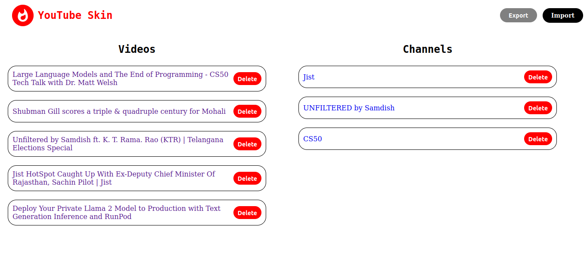

# YouTube Skin
Firefox extension to add skin to YouTube page 
Download extension file from here: [extension](./latest-extension-file/yt_skin-1.0.13.xpi) 
Source code can be found in `source` directory

## Features
1. Save videos and channels through video page without logging in 
Buttons are shown up in navbar 
* Save button saves the url of video with title
* Subscribe button saves the channel url of that video with channel name 

2. Export/Import the saved videos and channels in json format through settings page
* Can be accessed by clicking on extension button in browser

3. Remove saved videos and channels through settings page of extension
* Can be accessed by clicking on extension button in browser 

## Credits
Channel and video data is fetched from https://yt.lemnoslife.com APIs.

    
<h2>Issues</h2>

    

        
Sometimes buttons are not visible on the video page<b>[Fixed]</b>
 
        <s>Reason: div element not available when extension script runs</s> 
        <s>Quick fix: reload the video page</s> 
        If this issue exists because of update in youtube and element id does not exist anymore then please raise a pr by modifying <code>ytElementId</code> constant in <code>app.js</code> with its new element id or let me know by raising an issue.
    

## Improvements required
* Add tags for the saved videos to apply filter
* Unsubscribe and unsave button functionality in youtube page for their respective buttons
* Improve ui of settings page
* Remove multiple api calls to get data
* Optimizations in remove button on settings page

## Development
* PRs for issues and improvements are welcome
* Please raise the pr for master branch